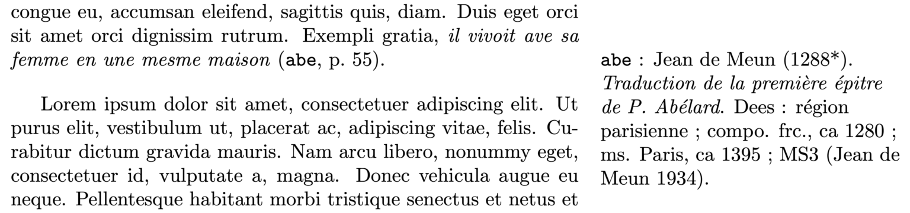
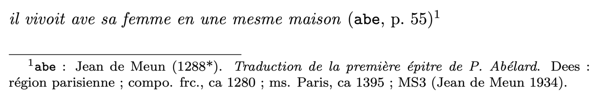

# NCA_bib
BibLaTeX files for citing texts from the NCA corpus.

Documentation at: [https://phonodiachro.hypotheses.org/programmes-et-scripts/fichiers-bib-nca](https://phonodiachro.hypotheses.org/programmes-et-scripts/fichiers-bib-nca).

Delivered under a separate BY-NC-SA 4.0 licence. If you use these, please mention:

> Premat, Timothée (2024). “Fichiers .bib pour le NCA”. Retrived on the XX/XX/XXXX. Url : https://github.com/TimotheePremat/NCA_bib

***Nota: links to DEAFbib are broken, to be fixed.***

## Documentation (French)

Dans le cadre de ma thèse, j’ai établi des notices BibLaTeX pour les 296 textes du Nouveau Corpus d’Amsterdam.

Les fichiers suivants ont été produits par extraction automatique des données, puis une partie des notices a été corrigée à la main, avec ajout du lien vers l’identifiant dans la bibliographie du DEAF et notice de l’édition de référence (le plus souvent le livre dont le NCA reprend l’édition).

- NCA_verif.bib : contient les notices vérifiées et corrigées
  - avec lien DEAF
  - avec notice indépendante pour l’édition
- NCA_non_verif.bib : contient les notices non systématiquement vérifiées
  - sans lien DEAF
  - sans notice indépendante pour l’édition
  - les ID sont marqués d’un astérisque

Les deux fichiers représentent l’ensemble du corpus NCA.
Toutes les notices des textes sont de type `misc`, tandis que les notices des éditions sont de type standard (`book`, `article`, etc.). Les métadonnées ont été entrées dans le champ `note` des notices `misc`.

Le but de ces fichiers est d’obtenir (a) une manière facile de citer les textes du corpus en plein texte, en incorporant les métadonnées pertinentes, et (b) de produire une liste des textes distincte de la bibliographie générale. Le rendu cible d’une citation en plein texte est représenté sur la figure suivante :


_Note marginale générée lors de la citation d’un texte._

Dans ce qui suit, j’indique les normes et abréviations utilisées pour les notices, et je donne quelques conseils sur la façon de les utiliser dans un document LaTeX.

Notez que je ne peux garantir l’exactitude de toutes les informations de ces notices, et que ce travail a été effectué indépendamment de celui de l’équipe du NCA.

### Abréviations utilisées dans les métadonnées

Les notices s’impriment ainsi :
> ```ID``` : Auteur (date de composition). Titre. Ms. [x] ; Dees : [région] ; compo. [région] [date] ; ms. [région] [date] ; MS[1-3]/CR[1-3] ([éd.]), DEAF : [identifiant DEAF].

Par exemple : ```alia``` : Anon. (1185*). Roman d’Alexandre. Ms. A ; Dees : Vendée, Deux-Sèvres ; compo. pic. et occ. orient., ca 1185 ; ms. poit., ca 1225 ; MS (Anon. 1937) ; DEAF : ```AlexArsL```.

- Ms. [x]. Nom du témoin manuscrit dans la tradition philologique
- Dees : [région]. Région définie par Dees (1987), par comparaison dialectométrique avec les données de Dees (1980). Les régions de Dees ont parfois un nom composé (cf. Vendée, Deux Sèvres dans l’exemple : une seule région).
- compo. [région] [date]. Localisation ou dialecte et date de composition, tels que définis par la bibliographie philologique.
- ms. [région] [date]. Localisation ou dialecte et date de copie du témoin retenu, tels que définis par la bibliographie philologique.
- MS[1-3]/CR[1-3]. Qualité de l’édition :
	- MS : édition diplomatique, de non interventionniste (1) à interventionniste (3)
	- CR : édition critique, de peu interventionniste (1) à interventionniste (3)
	- Certaines éditions sont cotées MS ou CR sans chiffre dans les métadonnées.
- DEAF : identifiant de l’édition dans la bibliographie du DEAF, avec lien vers la notice pour les textes vérifiés. Pour les textes non vérifiés, certains ID DEAF dans les métadonnées du NCA n’existent pas dans le DEAF.
	- Au moment où j’écris ces lignes, le serveur de la bibliographie du DEAF semble inaccessible : tous les liens aboutissent sur une erreur 404.

Lorsque l’indication de MS est absente, c’est que le sigle du MS au sein de la tradition (s’il existe), n’est pas donné dans les métadonnées du NCA. Lorsque la localisation de Dees est placée entre crochets, c’est que la variable regionDees est absente, mais que l’information de Dees est restituée à partir d’une autre variable (```codeRegional``` ou ```coefficientRegional```). Les informations de composition (_compo._), de copie (_ms._) et de qualité éditoriale (_MS[1-3]_, _CR[1-3]_) viennent du travail sur la bibliographie philologique de l’équipe du NCA. Lorsque l’édition est identifiée et publiée, elle est indiquée après l’évaluation de la qualité, soit par le nom de l’auteur soit par le nom de l’éditeur, selon que l’auteur est anonyme ou non, et selon le type de publication.

#### Étiquettes dialectales et géographiques

- ***a.n.*** Anglo-normand
- ***art.*** Dialecte de l’Artois
- ***Belgique*** Dialecte de Belgique, sans plus de précisions
- ***bourg.*** Bourguignon
- ***Centre*** Dialecte du Centre, sans plus de précisions
- ***champ.*** Champenois
- ***Est*** Dialecte de l’Est, sans plus de précisions
- ***fla.*** Dialecte de la Flandre
- ***franc.*** Francien ( ?)
- ***frc.*** Franc-comtois
- ***hain.*** Dialecte du Hainaut
- ***liég.*** Liégeois
- ***lorr.*** Lorrain
- ***Meuse*** Dialecte de la Meuse.
- ***NE*** Dialecte du Nord-Est, sans plus de précisions
- ***NO*** Dialect du Nord-Ouest, sans plus de précisions
- ***Nord*** Dialecte du Nord, sans plus de précisions
- ***norm.*** Normand
- ***norm.-pic.*** Normanno-picard
- ***Oise*** Dialecte de l’Oise
- ***orl.*** Orléanais
- ***Ouest*** Dialecte de l’Ouest, sans plus de précisions
- ***pic.*** Picard
- ***poit.*** Poitevin
- ***saint.*** Saintongeais
- ***SE*** Dialecte du Sud-Est, sans plus de précisions
- ***SO*** Dialecte du Sud-Ouest, sans plus de précisions
- ***Soissonnais*** Dialecte de Soisson et de la région environnante
- ***tour.*** Dialecte tourangeau
- ***wall.*** Wallon
- ***Beauvais*** Dialecte de la ville de Beauvais
- ***La Rochelle*** Dialecte de la ville de La Rochelle
- ***Liège*** Dialecte de la ville de Liège, dénomination plus précise que liégeois
- ***Lille*** Dialecte de la ville de Lille
- ***Tournai*** Dialecte de la ville de Tournai
- ***Troyes*** Dialecte de la ville de Troyes
- ***traits de l’Ouest*** Dialecte indéfini mais présentant principalement des traits occidentaux
- ***traits norm. ?*** Dialecte indéfini mais présentant principalement des traits probablement normands
- ***traits occ. et a.n.*** Dialecte indéfini mais présentant principalement des traits occidentaux et anglo-normands
- ***traits orl.*** Dialecte indéfini mais présentant principalement des traits orléanais

### Utiliser ces fichiers dans un document LaTeX

Quelques conseils sur une des façons d’utiliser ces fichiers, si vous citez beaucoup de textes du NCA.

- Vous pouvez garder votre propre fichier ```.bib``` pour toutes les références hors NCA (```main.bib``` dans l’exemple infra)
- Vous pouvez imprimer la liste des titres du NCA cités dans votre texte uniquement, ou utiliser les ```\nocite{}``` _infra_ si vous voulez citer tous les textes
- Vous pouvez imprimer la liste des titres du NCA hors de la bibliographie, sous forme d’annexe. Les lignes de code ci-dessous permettent d’imprimer les références bibliographiques des éditions dans la bibliographie, et les informations sur les textes dans une annexe séparée.
- Ces notices sont prévues de manière à pouvoir faire un ```\fullcite{}``` en note facilement, pour donner au lecteur accès aux métadonnées du texte :
	- vous citez le texte ```abe``` en plein texte et faites un ```\fullcite{NCA_abe}``` en note
ce qui imprime : ```abe``` : Jean de Meun (1288*). Traduction de la première épitre de P. Abélard. Dees : région parisienne ; compo. frc., ca 1280 ; ms. Paris, ca 1395 ; MS3 (Jean de Meun 1934).
	- et qui imprime la même notice dans l’annexe de composition du corpus
	- et qui imprime dans la bibliographie générale : Jean de Meun (1934). _Traduction de la première épitre de P. Abélard._ Éd. Charlotte Charrier. Paris : Honoré Champion.
- Pour obtenir ce résultat, les notices des textes (pas des éditions) sont de type ```misc```, et les métadonnées sont comprises dans un champ note.

#### Dans le préambule

```
\usepackage[backend=biber,
            style=authoryear,
            bibstyle=authoryear]{biblatex}
\addbibresource{NCA_verif.bib} % Bib file for verified texts and editions
\addbibresource{NCA_non_verif.bib} % Bib file for other texts
\usepackage{hyperref}
```
Le package hyperref est nécessaire pour gérer le lien hypertexte derrière l’identifiant DEAF.

#### Lors d’une citation

Utilisation de base :
```
\footnote{\fullcite{}}
```

Citez l’identifiant du texte en plein texte, et ajoutez un ```\fullcite{}``` en note.

Le code suivant :

```
\documentclass{article}

\usepackage[backend=biber,
            style=authoryear,
            bibstyle=authoryear]{biblatex}
\addbibresource{NCA.bib}
\usepackage{hyperref}

\begin{document}

\emph{il vivoit ave sa femme en une mesme maison} (\texttt{abe}, p.~55)\footnote{\fullcite{NCA_abe}.}

\end{document}
```
Donne :


#### Utiliser des notes marginales : ```\marginnote{\fullcite{}}```

Le résultat est encore plus lisible si vous utilisez des notes marginales (package ```marginnote```). La commande ```\marginnote{}``` évite également l’apparition d’un appel de note (inutile puisque la note marginale est alignée verticalement).

Le code suivant :
```
\documentclass[twoside]{article}
\usepackage[a4paper,
            marginparwidth=150pt,
            total={10cm, 10cm}]{geometry}
\usepackage{lipsum}

\usepackage[backend=biber,
            style=authoryear,
            bibstyle=authoryear]{biblatex}
\addbibresource{NCA_verif.bib} % Bib file for verified texts and editions
\addbibresource{NCA_non_verif.bib} % Bib file for other texts
\usepackage{hyperref}
\usepackage{marginnote}

\begin{document}

 \lipsum[1] Exempli gratia, \emph{il vivoit ave sa femme en une mesme maison} (\texttt{abe}, p.~55).\marginnote{\fullcite{NCA_abe}.}

 \lipsum[1]

\end{document}
```
Donne :


Utilisation des fichiers .bib avec \marginnote{\fullcite{}}.

#### Imprimer la liste des textes en fin de document

En annexes, ou avant ou après la bibliographie, vous pouvez imprimer la liste de tous les textes que vous avez cités ou la liste de tous les textes. Les conseils suivants s’appliquent si vous souhaitez donner la liste des textes indépendamment de la bibliographie générale de votre article (ce qui, à mon avis, est une bonne idée).

Pour imprimer uniquement les textes cités (p.ex. avec un ```\fullcite{}``` comme _supra_) dans votre article, il vous suffit d’ajouter une commande de bibliographie qui ne sélectionne que les textes dotés du mot-clef ```NCA_txt``` (qui est présent pour tous les textes mais uniquement pour ceux-ci). J’ajoute généralement ces lignes après la bibliographie générale :
```
\section*{Textes du NCA cités}
\printbibliography[heading=none,keyword={NCA_txt}]
```
Vous pouvez également choisir de vouloir afficher tous les textes du corpus, c’est-à-dire y compris ceux que vous n’avez pas cité dans votre travail. Dans ce cas, il vous faut utiliser la commande ```\nocite{}```, qui permet de passer en bibliographie des textes non cités. Comme le but n’est pas de déclencher ```\nocite{}``` sur tous les fichiers ```.bib``` (vous ne voulez pas qu’il s’applique à votre fichier de références scientifiques), il faut spécifier tous les ID. Voici la commande ```\nocite{}``` correspondant au 296 notices du NCA :
```
\nocite{NCA_abe, NCA_abreja, NCA_ailea, NCA_aileb, NCA_ailed, NCA_aileg, NCA_aileo, NCA_ailet, NCA_aiol, NCA_alia, NCA_amad, NCA_amile, NCA_amo, NCA_amou, NCA_anth, NCA_anti, NCA_arr, NCA_artch, NCA_athi, NCA_atre, NCA_auc, NCA_aucchants, NCA_avu, NCA_aye, NCA_baisieux, NCA_bar, NCA_barlaam, NCA_barril, NCA_beati, NCA_beauv, NCA_bel, NCA_benoit, NCA_bern2, NCA_besant, NCA_best, NCA_bodo, NCA_bourg, NCA_calen, NCA_calex, NCA_cambrai, NCA_carem, NCA_carp, NCA_cass, NCA_chaitH, NCA_chastoi, NCA_chauvency, NCA_chevreH, NCA_chevreS, NCA_chret1, NCA_chret2, NCA_chro, NCA_clari2, NCA_clef, NCA_cleom, NCA_coinci, NCA_compoit, NCA_conperc, NCA_contre, NCA_contro, NCA_cordres, NCA_cou, NCA_darm, NCA_desp, NCA_deusamH, NCA_deusamS, NCA_dole, NCA_durm, NCA_edmond, NCA_edmund, NCA_egip, NCA_elid, NCA_elie, NCA_eneas, NCA_enf, NCA_epee, NCA_equiH, NCA_equiS, NCA_eustache, NCA_evrat1, NCA_evratC2, NCA_fab4c, NCA_fab4e, NCA_fab4f, NCA_faba, NCA_fabb, NCA_fabd, NCA_fabj, NCA_fablesA, NCA_fablesB, NCA_fablesC, NCA_fablesE1, NCA_fablesK, NCA_fablesL, NCA_fablesM, NCA_fablesT, NCA_fablesY, NCA_fablesZ, NCA_faucon, NCA_fetrom, NCA_feu, NCA_fierens, NCA_flo, NCA_floov, NCA_gar, NCA_gepa, NCA_gerv, NCA_gibv, NCA_gir, NCA_gorm, NCA_graal, NCA_greg2, NCA_guib, NCA_guigH, NCA_guigP, NCA_guigS, NCA_guil, NCA_hard, NCA_helc, NCA_herm, NCA_hista, NCA_hue, NCA_hyla, NCA_ipo, NCA_jaco, NCA_jean, NCA_joinv, NCA_jongl, NCA_jouf, NCA_juda, NCA_juise2, NCA_kathe, NCA_lac, NCA_lanc, NCA_lancpr, NCA_lanvalC, NCA_lanvalH, NCA_lanvalP, NCA_lanvalS, NCA_laustH, NCA_lechS, NCA_lin, NCA_livre, NCA_loth, NCA_loys, NCA_mace, NCA_malk, NCA_marga, NCA_martin1, NCA_martin2, NCA_martin3, NCA_maur, NCA_mede, NCA_merlin, NCA_merm, NCA_meun, NCA_michel, NCA_milonS, NCA_milunH, NCA_mir, NCA_miro, NCA_modw, NCA_moral, NCA_moral2, NCA_mortartu, NCA_mous, NCA_mrgri, NCA_mule, NCA_myst, NCA_narcA, NCA_narcB, NCA_narcC, NCA_narcD, NCA_narcE, NCA_ndchar, NCA_neele, NCA_nic, NCA_nicb, NCA_nicoa, NCA_nima1, NCA_nima2, NCA_nima3, NCA_nima4, NCA_nimafrag, NCA_nimb1, NCA_nimb2, NCA_nimc, NCA_nimd, NCA_nimfrag, NCA_nouvel, NCA_oakbook, NCA_oct, NCA_ombre, NCA_or, NCA_orso, NCA_pap, NCA_papgreg2, NCA_pen, NCA_pera, NCA_perb, NCA_perc, NCA_percevalb, NCA_perf, NCA_perh, NCA_perl, NCA_perm, NCA_perp, NCA_perpraag, NCA_perq, NCA_perr, NCA_pers, NCA_pert, NCA_peru, NCA_plainte, NCA_poit, NCA_pon1, NCA_pon2, NCA_pritheo, NCA_prologueH, NCA_psautier, NCA_pseuturp, NCA_queste, NCA_raou, NCA_reis, NCA_remi, NCA_ren2, NCA_robert, NCA_robin, NCA_rolandox, NCA_roma, NCA_romb, NCA_rombriv, NCA_rombriva, NCA_romc, NCA_romd, NCA_rome, NCA_romh, NCA_romi, NCA_romk, NCA_roml, NCA_romm, NCA_romo, NCA_rose, NCA_rou1, NCA_rou2, NCA_rou3a, NCA_rou3b, NCA_sage, NCA_sapient, NCA_sept, NCA_sergbH, NCA_sergbO, NCA_songe, NCA_songe14, NCA_stsilv, NCA_sully2, NCA_teo2, NCA_thA, NCA_the, NCA_thebe, NCA_thebefrag, NCA_thibo, NCA_trib, NCA_troi, NCA_troifr, NCA_turp, NCA_vache, NCA_vcou, NCA_vergia, NCA_vergib, NCA_vergic, NCA_vergie, NCA_vergif, NCA_vergig, NCA_vergih, NCA_vergii, NCA_vergik, NCA_vergil, NCA_verite, NCA_verson, NCA_vilea, NCA_vilhar, NCA_volu, NCA_wallo, NCA_wita, NCA_yonecH, NCA_yonecP, NCA_yonecQ, NCA_yonecS, NCA_yva, NCA_yvf, NCA_yvg, NCA_yvh, NCA_yvp, NCA_yvs, NCA_yvv, NCA_yzop}
```
Les éditions, elles, sont rejetées dans la bibliographie générale. Pour générer celle-ci, ajoutez simplement une exclusion de mot-clef, comme suit. Comme les références des éditions n’ont jamais le mot-clef ```NCA_txt```, elles seront bien imprimées dans la bibliographie générale.
```
\printbibliography[notkeyword={NCA_txt}]
```
L’ensemble vous donne la liste (textes du corpus puis bibliographie) de 24 pages contenue dans le fichier `NCA_bib_and_ref_list.pdf`.
